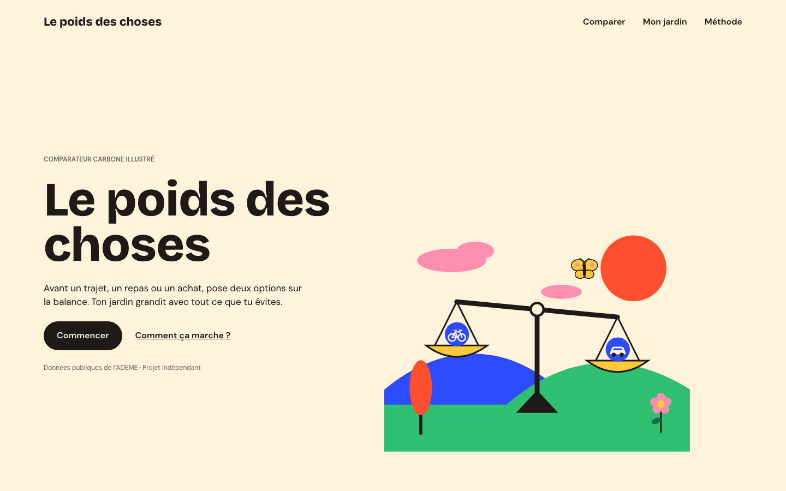
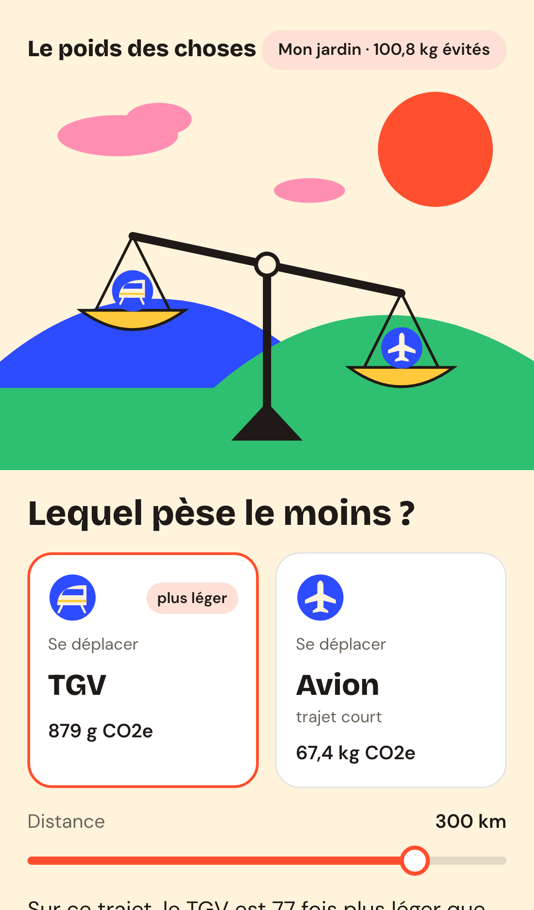
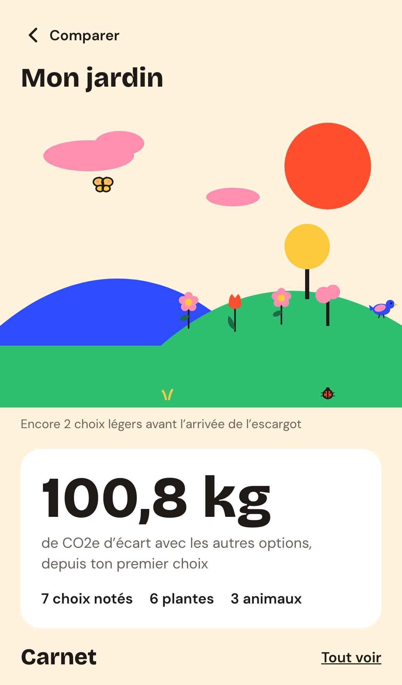

# Le poids des choses

Un comparateur carbone illustré : pose deux gestes du quotidien sur une balance, note ton
choix, et un jardin dessiné grandit chaque fois que tu choisis l'option la plus légère.

Projet vitrine du portfolio [webjuno.com](https://webjuno.com). Projet indépendant, non
affilié à l'ADEME.



| Le duel                                                                                                             | Le jardin                                                                                                                                |
| ------------------------------------------------------------------------------------------------------------------- | ---------------------------------------------------------------------------------------------------------------------------------------- |
|  |  |

## Fonctionnalités

- **Comparer deux gestes** de même unité : se déplacer (par km, curseur de 1 à 1 000 km),
  manger (par repas), boire (par litre), se faire livrer (par achat). La balance penche
  selon l'écart, une phrase le dit (« 77 fois plus léger ») et le traduit en kilomètres de
  voiture.
- **Objets** (vêtements, appareils) : neuf, d'occasion (livré en colis ou non) ou « je garde
  le mien ».
- **Le carnet et le jardin** : chaque choix plus léger fait pousser une plante ; un choix plus
  lourd est simplement noté, rien n'est retiré. Les animaux arrivent au fil des choix ;
  après trois semaines sans visite, le jardin s'assoupit sous la brume.
- **Le carnet reste sur l'appareil** : carnet dans le navigateur, export et import en
  fichier. Installable sur l'écran d'accueil.
- **Compte facultatif** pour retrouver son jardin sur un autre appareil : lien magique par
  e-mail (sans mot de passe), synchronisation append-only qui n'écrase jamais une entrée
  locale, file d'attente hors ligne, export et suppression immédiate du compte. Un seul
  cookie, posé seulement à la connexion.
- **URL partageable** pour chaque comparaison, accessible au clavier et aux lecteurs
  d'écran, animations coupées si le système le demande.

## Stack

- [Next.js](https://nextjs.org) 16 (App Router) + React 19 + TypeScript, export 100 %
  statique hébergé sur Cloudflare Pages
- Compte : Cloudflare Pages Functions + D1 (migrations versionnées), e-mails Resend,
  anti-robot Turnstile
- Tailwind CSS 4 (thème issu des variables Figma)
- GSAP + `@gsap/react` pour les animations (balance, plantes, animaux, vent, ciel)
- Vitest (tests unitaires), Playwright + axe (bout en bout et accessibilité, Chromium et
  WebKit), Lighthouse, ESLint, Prettier, GitHub Actions
- pnpm, Node 24

## Architecture

```
public/illustrations/   SVG dessinés (un fichier par stade, calques nommés)
scripts/                données (CSV Impact CO2), conversion des SVG, images, garde-fous
src/app/                pages : accueil, /comparer, /jardin, /saison, /methode, /connexion,
                        /confidentialite, /mentions-legales, 404
functions/api/          Pages Functions (routes du compte), logique dans server/
server/                 API du compte : liens magiques, sessions, limites, carnet, entretien
migrations/             schéma D1 versionné
src/components/         écrans (compare, garden, home), scène animée (scene), interface (ui)
src/lib/                logique pure et testée : calc, compare, garden, journal, data, site
e2e/                    tests Playwright, serveur de test (en-têtes Cloudflare), wrangler pages
                        dev et faux Resend / Turnstile pour le compte
docs/                   méthode, conventions SVG, journal de bord
```

- **Logique pure, interface mince** : calculs, phrases, URL, jardin (placement déterministe
  des plantes), carnet (validation, fusion) sont des fonctions sans effet de bord, testées
  dans `src/lib`.
- **Illustrations** : `pnpm illustrations` convertit chaque SVG en composant React ; les `id`
  deviennent des `data-part` (un même dessin peut s'afficher plusieurs fois) et un contrat
  (`src/lib/illustrations/specs.ts`) vérifie tailles et calques. Les collines de la scène
  sont lues dans le dessin pour y poser les plantes.
- **Carnet** : `localStorage` versionné, repli en mémoire en navigation privée, migrations
  prévues.

## Données et méthode

Les chiffres viennent du [fichier public d'Impact CO2](https://impactco2.fr) (ADEME, Base
Carbone, Agribalyse), récupéré par `pnpm build-gestures` et versionné
(`src/lib/data/gestures.generated.json`). Chaque geste garde sa source. Les hypothèses
(occasion = pas de nouvelle fabrication, colis, trajets des achats), ce qui n'est pas compté
et les limites sont expliqués sur la page [/methode](src/app/methode/page.tsx) et dans
[docs/methode.md](docs/methode.md). Le jardin n'est pas une empreinte carbone : il ne garde
que la trace des écarts entre les options comparées, pas des kilos évités.

## Comment j'ai travaillé avec l'IA

Le site a été conçu, illustré et dessiné à la main (Figma) ; le code a été écrit avec
[Claude Code](https://claude.com/claude-code), l'assistant de programmation d'Anthropic,
lot par lot :

- **Des lots courts et relus** : chaque lot (données, jardin, parcours, pages, qualité…)
  part d'une consigne précise, se fait sur une branche et arrive en demande de fusion que je
  relis avant de fusionner. Rien n'est poussé sur `main` sans accord.
- **Des règles écrites** dans [CLAUDE.md](CLAUDE.md) : conventions, garde-fous (aucune donnée
  fictive ni mention légale vide en production), fonctionnement du projet.
- **Un journal de bord** ([docs/journal.md](docs/journal.md)) : pour chaque session, ce qui
  a été demandé, proposé, gardé ou changé — y compris les erreurs repérées et corrigées.
- **Les maquettes comme référence** : l'IA lit les écrans Figma (connecteur officiel) et
  s'y conforme ; les écarts sont signalés plutôt qu'improvisés.
- **Vérifier plutôt que supposer** : chaque lot passe le lint, les tests et le build, puis
  une vérification dans le navigateur.

## Commandes

```bash
pnpm install
pnpm dev             # développement
pnpm build           # illustrations, images, garde-fous puis export statique dans out/
pnpm lint            # ESLint
pnpm test            # tests unitaires (Vitest)
pnpm e2e             # tests de bout en bout et accessibilité (après pnpm build)
pnpm lighthouse      # scores Lighthouse mobile (après pnpm build et pnpm serve:out)
pnpm format          # Prettier
pnpm pages:dev       # export + Pages Functions en local (après pnpm build et db:migrate:local)

pnpm build-gestures  # régénère les données depuis le CSV Impact CO2 (à la main)
pnpm illustrations   # reconvertit les SVG après un nouvel export
pnpm images          # icônes et image de partage
pnpm captures        # captures de ce README (export servi sur le port 4323)
```

Variables de build : `STRICT_DATA=1` (bloque s'il reste des données fictives ou des mentions
légales à remplir), `SITE_LAUNCHED=1` (lève le noindex, ouvre robots.txt et le sitemap),
`SITE_URL` (adresse publique).

## Licences

- **Code** : licence MIT.
- **Illustrations et identité visuelle** (dessins, icône, image de partage, nom, direction
  artistique) : **tous droits réservés**, hors licence MIT.
- Données : Impact CO2 – ADEME, réutilisation autorisée par l'équipe Impact CO2 (e-mail du
  5 octobre 2026), avec la mention « Données : Impact CO2 – ADEME ». Polices : SIL Open Font License.

Le détail est dans [LICENSE](LICENSE).
